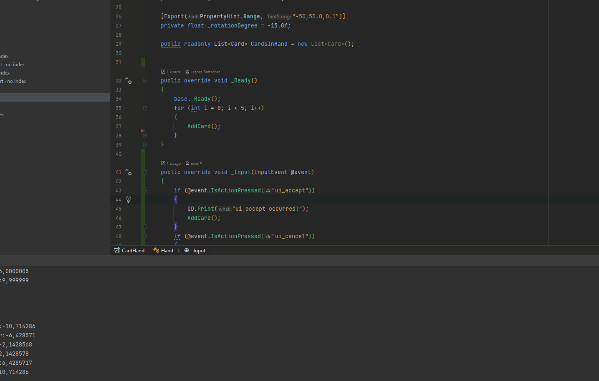

# HandOfCards

Follow along to the video [Fanning 3D cards with Curves: Godot 4](https://www.youtube.com/watch?v=S60pMTsePqI&ab_channel=Bramwell) from Bramwell. The implementation however is done in C# and with 2D cards.
